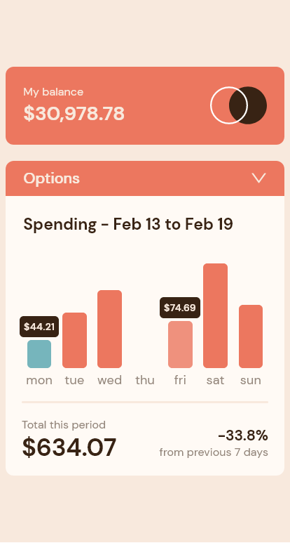
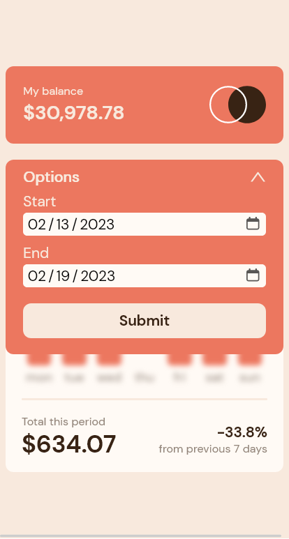

# Frontend Mentor - Expenses chart component solution

This is a solution to the [Expenses chart component challenge on Frontend Mentor](https://www.frontendmentor.io/challenges/expenses-chart-component-e7yJBUdjwt). Frontend Mentor challenges help you improve your coding skills by building realistic projects.

## Table of contents

- [Overview](#overview)
  - [The challenge](#the-challenge)
  - [Screenshot](#screenshot)
  - [Links](#links)
- [My process](#my-process)
  - [Built with](#built-with)
  - [What I learned](#what-i-learned)
  - [Continued development](#continued-development)
- [Author](#author)

## Overview

### The challenge

Users should be able to:

- View the bar chart and hover over the individual bars to see the correct amounts for each day
- See the current day’s bar highlighted in a different colour to the other bars
- View the optimal layout for the content depending on their device’s screen size
- See hover states for all interactive elements on the page
- **Bonus**: Use the JSON data file provided to dynamically size the bars on the chart

### My additional challenges:

- User should be able to set a a specific date range and view an updated graph

### Screenshot

Screenshot of my solution, note the addition of the 'Options' form.

 

### Links

- Solution URL: [My Solution on GitHub](https://github.com/mike-uffelman/FE-Challenge---expenses-comp)
- Live Site URL: [My Solution hosted on Netlify](https://main--leafy-twilight-c33d4f.netlify.app/)

## My process

### Built with

- Semantic HTML5 markup
- CSS custom properties
- Flexbox
- Mobile-first workflow
- [React](https://reactjs.org/) - JS library
- [Fakerjs](https://fakerjs.dev/) - Generate Dummy Data

### What I learned

The intention for this project was to practice building up a component from a pre-defined design, which included layout, assets (images/svg/data), typography, and a color scheme.

On the surface this component is pretty simple, so to increase the functionality, I decided to add a form feature that will allow the user to set a date range and see the expenses for that range.

To achieve this, I created a generator function with Fakerjs to create additional expenses over many months. The additional data points result in greater functionality for the user and allowed for additional practice using more React features including useState, useEffect, and useRef.

The transaction data provided by the challenge was rather basic, so to add complexity and more substance to the transactions the data generator creates an ID, date, vendor, amount, and category of the expense (Note: Not all of these properties are currently used in this version of the component but could provide useful data for future versions. For example, clicking on a bar graph for a specific day could display all the transactions for that day with the vendor and product categories, which would provide valuable data for the user).

By introducing a more comprehensive data set, the data required more transforming and organizing to reach the final usable state. Transforming the raw transaction data from an array of individual transactions to an aggregated array which combined same day transactions into a discrete date objects and creating data for zero spend days there was a good amount of logic to work through.

## Transforming the data

The following section is a journey through the functions that transform the raw transaction data into a final object that is mapped over to render the component and it's features.

In the lower right corner of the UI component, the user can see the percent change for spending against the previous period. For example, if the component is showing seven (7) days of data, the change value is percent change from prior week to this week, ((current - previous)/previous) \* 100.

In order to do this, we have to determine the prior period start date, i.e. the number of days in the current period backwards from the current period start date, e.g. a current period of 1/1/2023 - 1/7/2023 is seven days, so the prior period is 7 days prior (12/25/2022 - 12/31/2022).

Note: Many of these steps could be refactored and combined, but I found that keeping them separate and as close to pure functions as possible improves the readability of the steps.

### Getting the prior period start date

The code snippet below gets the start date for the prior period by taking the current start date and subtracting the current period length from it.

The current start date is passed inside the new Date() constructor, which allows for the setDate() method to be called. Inside setDate(), which when called on a date object allows for the date (day) to be updated, we take the current start date and subtract the period length (daysBack) to get the prior period start date.

Wrapping it all in 'new Date()', the date will format to the string representation for ease of reading.

```js
new Date(new Date(start).setDate(new Date(start).getDate() - daysBack));
```

### Getting all days in date range (previous period + current period)

Next an array of dates for each day between the prior period start and the current end date is required. This will allow for an array comparison that will filter out duplicates and return the days which have no transactions. A simple for loop works here, where 'i' is the prior period start date and for 'i' less than or equal to the current end date, a new date will be created for each 'i' and pushed to an array (daysArray) defined prior.

```js
let daysArray = [];
for (
  let i = new Date(priorPeriodStart + 'T00:00:00');
  i <= new Date(endingDate + 'T00:00:00');
  i.setDate(i.getDate() + 1)
) {
  daysArray.push(new Date(i));
}
return daysArray;
```

### Get zero spend days

Now that we have a range for the entire date range we've queried, we can find the symmetric differences between all transactions and the desired date range, i.e. the days with zero spending (i.e. do not exist in the transaction data). The snippet below checks the transactions array for the date in the desired date range and if it does not exist, it creates a new object with properties of 'date' as the date missing from data and 'amount' of zero(0) and pushes the object to an array defined prior. This results in an array of the zero spend days.

```js
let completeRangeData = [];
const zeroSpendDays = dateRange.filter(
  (day) => !data.map((trans) => trans.date).includes(day)
);

completeRangeData.push(
  zeroSpendDays.map((day) => {
    return {
      date: day,
      amount: 0,
    };
  })
);
return completeRangeData.flat();
```

### Get transactions within date range

Next, the transaction data can be filtered by the desired date range. This will result in only the transactions that fall between the prior period start and the current end date.

```js
data.filter((a) => {
  return (
    new Date(a.date) >= new Date(dateRange[0]) &&
    new Date(a.date) <= new Date(dateRange.at(-1))
  );
});
```

### Combining filtered transactions and zero spend days

At this point, the filtered transactions array and the zero spend days array can be combined and sorted by date.

```js
const combineZeroAndTransactions = (zeroSpend, filteredTransactions) => {
  return [...zeroSpend, ...filteredTransactions].sort(
    (a, b) => new Date(a.date) - new Date(b.date)
  );
};
```

### Reduce date range transactions

And lastly, the array of combined zero spend days and transactions needs to be reduced to an object with each day as a key and an array of transactions as the value. This will allow for multiple transactions on a given day to be combined into a single date property within an object. Using the current date as a key to access the new object property, the function looks for the property with the given key (i.e. date), if it does not exist then it assigns an empty array as the value for the key. Then it takes the key property and pushes the current data index to the matching key property (i.e. date)

```js
const reduceDailyTransactions = (data) => {
  return data.reduce((accumulator, current) => {
    let key = current.date;
    if (!accumulator[key]) accumulator[key] = [];
    accumulator[key].push(current);
    return accumulator;
  }, {});
};
```

This results in an object like this:

```js
"2022-12-25": Array [ {…}, {…} ]
    0: Object { id: "d3496e6f-2b61-4a44-9a1e-e58940c2690e", date: "2022-12-25", amount: 65.77, … }
        amount: 65.77
        category: "Tools"
        date: "2022-12-25"
        id: "d3496e6f-2b61-4a44-9a1e-e58940c2690e"
        vendor: "Jerde - Konopelski"
    1: Object { id: "fa2e3744-b5ea-4b4d-ab19-e3361443ae94", date: "2022-12-25", amount: 64.7, … }
"2022-12-26": Array(3) [ {…}, {…}, {…} ]
"2022-12-27": Array(4) [ {…}, {…}, {…}, … ]
...
"2023-01-07": Array [ {…}, {…} ]
```

With this reduced data object, it can be passed into each child component and render the appropriate information for the user.

### Additional challenge - Dates

Working with dates in JavaScript can be difficult and frustrating, so in this component dates were converted to strings and the time and timezone values were removed to keep it as simple as possible. For example "2022-10-13T12:44:20" is converted to "2022-10-13". And anytime the date was required for a calculation the date was passed into the new Date() constructor with the time and timezone added back in like this 'new Date("2023-10-13"+"T00:00:00")'.

### Continued development

Additional features that could be added to this component include:

- A modal that shows all the transactions for a selected day on the graph.
- A graph toggle that would show spending by category for a given time frame, maybe a pie chart.
- Pre-set date ranges, e.g. this month, last month, last 3 or 6 months, etc.

## Author

- LinkedIn - [Mike Uffelman](https://www.linkedin.com/in/michael-uffelman-34289521)
- Frontend Mentor - [mike-uffelman](https://www.frontendmentor.io/profile/mike-uffelman)
- GitHub - [mike-uffelman](https://github.com/mike-uffelman)
